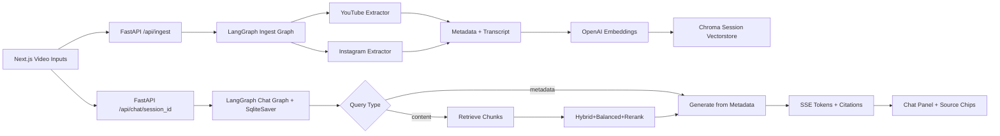

# Creator RAG — Video Analytics Chatbot

Production-grade RAG chatbot that compares one YouTube video and one Instagram Reel using extracted metadata, transcripts, engagement metrics, LangGraph memory, Chroma vector search, and streaming citations.

## Architecture



## Stack Decisions

| Layer | Choice | Reasoning |
|---|---|---|
| Backend API | FastAPI | Typed async API surface with simple deployment on Railway |
| Agent orchestration | LangGraph | Required state machine, deterministic nodes, **durable SqliteSaver** thread state (survives restart/multi-worker) |
| Vector DB | ChromaDB | Session-scoped collections for isolated two-video comparisons |
| Retrieval | Hybrid (dense + BM25 RRF) + per-video balancing + rerank | Precision on comparison queries; lexical catches hooks/CTAs/hashtags dense misses |
| Reranking | Cohere cross-encoder (opt-in) / lexical fallback | True cross-encoder when keyed; deterministic lexical re-scoring otherwise |
| Embeddings | `text-embedding-3-small` | Low cost, strong retrieval quality for transcript chunks |
| Chat model | `gpt-4o-mini` | Required model, low latency, defensible cost profile |
| Video extraction | `yt-dlp`, `youtube-transcript-api`, `instaloader` | Dynamic public metadata and transcript extraction without hardcoded demo values |
| Frontend | Next.js | Server-side proxy for API key isolation and deploy-ready UI |
| Streaming | SSE | Simple CEO-demo-friendly token streaming over standard HTTP |

## Cost Analysis

| Usage | Estimated Daily Cost | Notes |
|---|---:|---|
| 1,000 creators/day | ~$2/day | Assumes two short videos per creator, cached session vectorstores, concise chat usage |
| 10,000 creators/day | ~$80/day | Higher chat volume and repeated extraction dominate cost |

## Setup

```bash
python -m venv .venv
.venv\Scripts\activate
pip install -r requirements.txt
cd frontend && npm install
cd .. && uvicorn app.main:app --host 0.0.0.0 --port 8000
```

## Environment

Copy `.env.example` and configure:

- `OPENAI_API_KEY`
- `OPENAI_CHAT_MODEL=gpt-4o-mini`
- `OPENAI_EMBEDDING_MODEL=text-embedding-3-small`
- `ADMIN_API_KEYS`
- `USER_API_KEYS`
- `DATABASE_URL`
- `CORS_ALLOWED_ORIGINS`

Frontend server-side proxy variables live in `frontend/.env.example`:

- `RAG_API_BASE_URL`
- `RAG_API_KEY`

## Live URLs

| Service | URL |
|---|---|
| Backend | Fill after deploy |
| Frontend | Fill after deploy |
| Health check | Fill after deploy |

## Why LangGraph Over LangChain

LangGraph is used because this product needs explicit state, not a single opaque chain. The ingest graph extracts both videos, computes metrics, and builds the session vectorstore. The chat graph routes metadata questions differently from transcript questions, retrieves only when needed, and persists conversation state by `thread_id` with a **durable SqliteSaver checkpointer**, so sessions survive restarts, redeploys, and multi-worker deployments. That makes the demo inspectable, deterministic, resumable, and easier to defend in a live code review.

## Scaling Path (config-only, no code changes)

| Concern | Default (demo) | Scale switch |
|---|---|---|
| Conversation memory | SqliteSaver (durable, 1 box) | `CHAT_CHECKPOINTER_BACKEND=postgres` |
| Vector store | In-process Chroma | `VIDEO_VECTORSTORE_BACKEND=qdrant` + `QDRANT_URL` |
| Reranking | Lexical re-scoring | `RERANKER_PROVIDER=cohere` + `COHERE_API_KEY` |
| Ingestion | Concurrent in-process (both videos parallel) | DB-backed worker (`app/workers/ingestion_worker.py`) |

Each backend degrades gracefully to the in-process default if misconfigured, so a
live demo never breaks on infrastructure.

## Known Limitations

- Instagram public metadata is inconsistent; comments and followers fall back to zero when platforms do not expose them.
- Conversation memory is durable (SqliteSaver default); set `CHAT_CHECKPOINTER_BACKEND=postgres` for shared state across workers.
- Vector store is in-process Chroma by default; set `VIDEO_VECTORSTORE_BACKEND=qdrant` (+ `QDRANT_URL`) for multi-worker scale, or `VIDEO_CHROMA_PERSIST_DIR` to persist across restarts.
- Reranking is lexical by default; set `RERANKER_PROVIDER=cohere` (+ `COHERE_API_KEY`) for a true cross-encoder. All scale backends fall back gracefully if misconfigured.
- YouTube transcripts depend on transcript availability for the target video.
- Long-running extraction should move to a background job queue for high traffic.
- Multi-worker deployments need shared session state instead of module-level memory.
